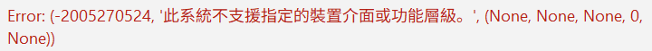

# Hololive Dreams Auto Jump Rope — 1.0

[繁體中文](README.md) · [简体中文](README.zh-CN.md) · [English](README.en.md) · [日本語](README.ja.md) · [한국어](README.ko.md) · [Indonesian](README.id.md)

Windows 버전 《hololive Dreams》의 자동 줄넘기 프로그램입니다. 게임 화면에서 줄의 위치를 인식하고 일반 마우스 입력으로 점프하며, 결과 화면을 확인한 뒤 다음 라운드를 시작합니다.

## 다운로드

[GitHub Releases](https://github.com/harrykuang-dev/Hololive-Dreams-Jump-Rope-Auto/releases/tag/v1.0)에서 `HololiveDreamsJumpRopeAuto-1.0.exe`를 다운로드하세요.

EXE 하나만 실행하면 되며 Python 설치가 필요 없습니다. SHA-256 검증 파일도 제공됩니다. 소스 ZIP은 직접 빌드해야 합니다.

## 기능

- 줄의 움직임을 추적하고 점프 시점을 자동으로 판단합니다.
- 시작 및 결과 메뉴를 인식하고 라운드가 끝나면 다음 라운드를 진행합니다.
- 번체 중국어, 간체 중국어, 영어, 일본어, 한국어, 인도네시아어를 지원합니다. 프로그램 언어를 변경해도 게임 설정은 바뀌지 않습니다.
- 목표 라운드에 도달하면 정지하며, 시작할 때마다 집계를 초기화합니다.
- 기본 단축키는 시작 F8, 정지 F9입니다. 설정란을 클릭하고 키 또는 키 조합을 누르면 변경할 수 있습니다. 시작과 정지 단축키는 서로 달라야 합니다.
- 실행 기록과 선택적으로 사용하는 로컬 개발자 진단 모드를 제공합니다.

## 사용 방법

1. 게임에서 줄넘기 시작 또는 결과 화면을 엽니다.
2. EXE를 실행하고 언어/Language에서 프로그램 언어를 선택합니다.
3. 목표를 1–999라운드로 설정합니다. 기본값은 1입니다. 단축키를 바꾸려면 설정란을 클릭하고 원하는 키를 누릅니다.
4. 시작 버튼이나 시작 단축키를 누릅니다. 프로그램이 게임을 전면으로 전환하려고 시도합니다. 게임 전체가 주 모니터 안에 보이도록 하고 다른 창으로 가리지 마세요. 어두운 색상, 짧은 머리, 장식과 액세서리가 적은 캐릭터를 권장합니다. 예: **쥬후테이 라덴(기본 의상)**과 픽셀 선글라스(pixel sunglasses).
5. 정지 단축키, 정지 버튼 또는 다른 창으로 전환하여 멈춥니다. 다시 시작하면 집계를 초기화합니다.

## 사용 조건과 제한

Windows 10／11 x64와 Windows 게임 클라이언트가 필요합니다. 게임 클라이언트 영역을 16:9로 유지하고 실행 중 최소화하거나 가리거나 이동하지 마세요. 백그라운드 플레이와 날짜 변경으로 로그아웃된 뒤 자동 재로그인은 지원하지 않습니다.

게임이 안정적으로 60 FPS를 유지하는 범위에서 그래픽 설정을 최대한 높이세요.

화면의 점프 입력은 조작 횟수입니다. 실제 점수는 게임 결과 화면에서 확인하세요. 캐릭터 색상, 애니메이션, 해상도, PC 성능과 게임 업데이트가 인식에 영향을 줄 수 있습니다. 문제가 생기면 정지하고 진단 자료를 제공하세요.

> [!WARNING]
> **듀얼 GPU 환경의 화면 캡처 오류**
>
> 시작할 때 `-2005270524 / 0x887A0004`(지정된 장치 인터페이스 또는 기능 수준이 지원되지 않음)가 나타나면 프로그램의 GPU 기본 설정을 변경하세요.
>
> 
>
> 1. Windows 설정 → 시스템 → 디스플레이 → 고급 디스플레이에서 게임에 사용하는 주 모니터를 선택하고, 연결된 GPU 이름을 확인합니다.
> 2. 디스플레이 → 그래픽(Windows 10에서는 그래픽 설정)으로 돌아가 데스크톱 앱을 추가하고, 실제 실행하는 `HololiveDreamsJumpRopeAuto-1.0.exe`를 선택합니다.
> 3. 해당 앱의 옵션／GPU 기본 설정에서 위 GPU를 선택하고 저장합니다. 절전은 보통 내장 GPU, 고성능은 보통 외장 GPU에 해당하므로 표시된 GPU 이름을 확인하세요.
> 4. 프로그램을 완전히 종료한 뒤 다시 실행하고 시작을 눌러 테스트합니다.
>
> 설정 대상은 프로그램 EXE입니다. 내장 화면과 외부 모니터, 외장 GPU 직접 연결 모드와 하이브리드 모드에서는 화면 출력을 담당하는 GPU가 다를 수 있습니다. 현재 화면의 연결 정보를 기준으로 선택하세요. 계속 실패하면 개발자 모드를 켜고 한 번 재현한 뒤 해당 실행 폴더의 `session.log`, GPU 모델과 화면 연결 정보를 제공하세요.

## 기술 구현

### 화면 캡처와 처리

[캡처 모듈](vision.py)은 DXGI／DXcam으로 게임 영역의 새 프레임을 가져오며 캡처 전후에 포커스, 위치, 크기와 가림 여부를 확인합니다. 제어 루프의 목표는 60 FPS이며 실제 속도는 게임의 새 프레임, 인식 비용과 시스템 스케줄링에 따라 달라집니다. 새 프레임이 없으면 이전 화면으로 점프하지 않습니다. 캡처 공백이 100ms 이상이면 복구 프레임을 버리고 인식기를 초기화합니다. 500ms 안에 새 프레임을 얻지 못하면 정지합니다.

[영역 처리](priority.py)는 960×540을 인식 기준으로 사용하며 샘플 영역을 먼저 잘라 같은 배율로 축소합니다. 잘라낼 경계를 입력과 출력 해상도의 정수 비율에 맞추어 원래 샘플 위치를 유지하면서 불필요한 픽셀 연산을 줄입니다.

### 줄 인식과 곡선 추정

[추적기](candidate_tracker.py)는 가로 방향의 다섯 구간에서 총 100개 열을 샘플링합니다. HSV 범위로 파랑／보라, 금색, 분홍과 밝은 흰색 후보를 고른 뒤 프레임 간 움직임과 가는 선의 명암 특징으로 배경을 제외합니다. 서로 다른 구간의 점들로 여러 이차 곡선을 구하고, 곡선 위 지지율과 구간별 분포를 평가합니다. 신뢰도가 높은 관측은 다음 추적에 쓸 줄 색상 기준도 갱신합니다.

선택한 곡선에서 플레이어 위치에 대한 상대 높이, 가시 지지율, 주요 색상과 이동 방향을 구합니다. 캐릭터나 소품이 중앙을 가려도 양쪽의 보이는 조각으로 곡선 추정을 제한할 수 있습니다. 증거가 부족하면 재관측에 필요한 상태를 유지하고 고정 주기로 점프하지 않습니다.

### 점프 판단과 가림 복구

[인식기](jump_detector.py)는 접근, 통과, 이탈과 낮은 줄의 방향 전환 상태로 같은 통과에서 이미 입력했는지 판단합니다. 가림 후 다시 점프를 허용할 때 연속으로 보이는 조각, 양쪽 지지와 높이 변화를 확인하여 중복 입력을 줄입니다.

급변 검사는 마지막 실제 관측 시각과 마지막으로 받아들인 위치의 시각을 분리합니다. 일부만 지지되는 곡선이 갑자기 플레이어 쪽으로 이동해도 저장 위치가 오래되었다는 이유만으로 받아들이지 않습니다. 최근 세 관측이 신뢰할 만한 연속 접근을 보여 주면 정상 판단으로 돌아갈 수 있습니다.

### 입력, 메뉴와 다음 라운드

[제어기](jump_rope_bot.py)는 점프 후보가 나오면 새 화면을 다시 캡처해 플레이 중인지, 플레이어가 조작 가능한지, 점프 버튼이 보이는지 확인합니다. 상대 좌표를 화면 좌표로 바꾸고 Windows 마우스 입력으로 왼쪽 버튼을 25ms 누르도록 요청합니다. 도중에 중단되어도 버튼을 해제합니다. 실제 누른 시간은 진단에 기록되며 시스템 스케줄링에 따라 달라질 수 있습니다.

메뉴 인식은 버튼 위치, 청록색 캡슐 외곽선, 흰 테두리와 페이지 색상을 사용하고 내부 글자는 비교하지 않습니다. 여러 프레임을 확인하며 같은 페이지의 재시도 횟수를 제한합니다. 게임 HUD를 확인하면 해당 라운드의 메뉴 조작을 중단합니다. [세션 제어](batch_session.py)는 이전 라운드 종료와 안정된 결과 화면을 확인한 뒤 다음 라운드를 시작하고 목표에 도달하면 정지합니다. 화면과 일반 입력만 사용하며 게임 프로세스 메모리, 저장 데이터나 게임 파일을 읽거나 수정하지 않습니다.

## 문제 보고와 개발자 모드

다음 라운드 진행 실패, 점프 이상 등은 [GitHub Issues](https://github.com/harrykuang-dev/Hololive-Dreams-Jump-Rope-Auto/issues)에 보고하세요.

문제를 재현하기 전에 개발자 모드를 켜세요. 진단 이미지, 프레임별 인식 기록, 입력 시각과 처리 시간을 로컬에 저장하며 자동 업로드하지 않습니다. 켜면 처리 부하가 증가합니다.

오른쪽 `?`를 누르면 진단 폴더를 확인하고 열 수 있습니다.

```text
%LOCALAPPDATA%\HololiveJumpRopeAuto\sessions\
```

실행할 때마다 시간으로 이름을 지정한 폴더를 만들고 각 라운드 종료 후 `round-번호` 폴더에 `diagnostics.zip`을 생성합니다. 프로그램 버전, 게임 언어／캐릭터, 해상도, Windows 배율, 문제 설명과 해당 라운드의 ZIP을 제공하세요.

## 소스와 라이선스

소스 실행, 빌드, 테스트와 진단 형식은 [개발 안내](docs/DEVELOPMENT.md), 이 대화에서 정리한 변경 사항은 [버전 이력](docs/VERSION_HISTORY.md)을 참조하세요. 이전 버전은 이미 대체된 역사적 버전으로 표시되어 있습니다. 두 문서는 번체 중국어로 작성되어 있습니다.

코드는 [MIT License](LICENSE)를 따릅니다. Logo 및 게임 관련 권리는 각각의 권리자에게 있습니다.
