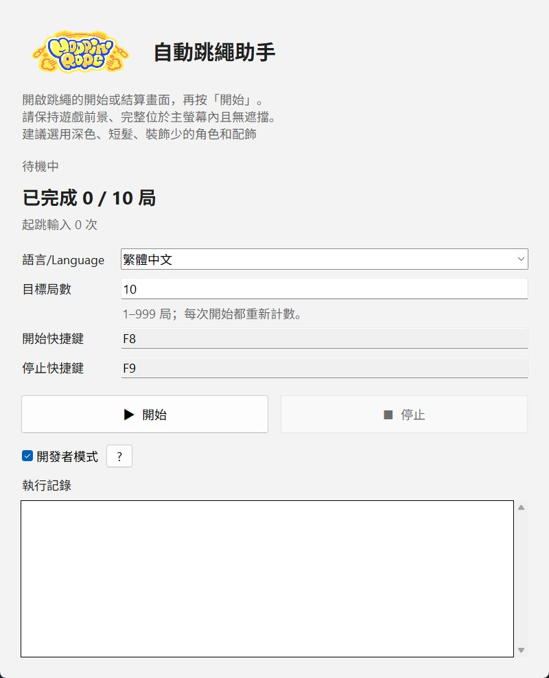

# Hololive Dreams Jump Rope Auto — 1.0

Windows 上的实时视觉跳绳助手。V27 使用已选定的 `speed2 + snap_clock` 控制核心，按键保持 **25ms**。图形界面参考 [Fishing Auto](https://github.com/harrykuang-dev/Hololive-Dreams-Fishing-Auto)，支持繁體中文、简体中文、English、日本語、한국어和 Indonesian。



## 使用

运行 `HololiveDreamsJumpRopeAuto-1.0.exe`，打开游戏的跳绳游玩入口或成绩页，设定局数后按 **F8** 或点击开始。游戏须在前景，完整位于主屏幕内且无遮挡。建议选用深色、短发、装饰少的角色和配饰。EXE 自带运行环境。

- 局数范围 1–999，默认一局；每次开始重新计数。上一局稳定显示成绩页后才开下一局。
- 可分别设置开始、停止快捷键，默认F8开始、F9停止。点击快捷键栏，再按键录入；更换停止快捷键后只响应新设置。
- **不修改能量，不使用恢复、道具、购买、BOOST 或 MODE。零能量可以正常游玩。**
- 界面语言只改变助手文字。菜单按钮识别依据位置、青色外框及页面配色，排除按钮文字；真实游戏各语言仍需实机验证。
- 窗口移动、失焦、遮挡或无法确认画面时停止。同一时间只运行一个控制器。关闭旧测试程序后再使用本程序。
- 界面计数是**起跳输入次数**，游戏分数请看结算画面。

## 开发者模式

默认关闭；关闭时不启用诊断模块、不保存截图。开启后保存完整逐帧判定、按键时间、原图与绳线诊断图，以及掉心／结束前后的密集截图。**不录制或打包视频。** 每局结束后生成不超过20MiB的 `diagnostics.zip`，可手动附在GitHub Issue中，不自动上传。

目录：`%LOCALAPPDATA%\HololiveJumpRopeAuto\sessions\时间戳\round-局号\`。开发者模式说明中的路径链接可进入当前会话。

ZIP包含：

- `frames.jsonl.gz`：完整逐帧JSON，每行一条观察。`t`为原始擷取时刻，`input_elapsed`为鼠标按下时刻；包含候选、输入、拟合结果、阶段及诊断用心数／玩家标记。心数和标记只是诊断估计，不控制游戏输入。
- `screenshots/`：最后20组事件原图与绳线叠加图；有测量时附该帧原始BGR采样列。形状、时刻及文件映射见 `manifest.json`。
- `failure-window/`：掉心或结束前约0.75秒、后约0.25秒的密集原图，最多保留80帧；若该帧已有事件截图则复用文件。中断时也保留结束前的画面。
- `performance.json`：实际识别帧率、延迟和完整按键脉冲。
- `session.json`、`session.log`：版本、EXE哈希和日志（ZIP中为最近1MiB，完整日志在会话目录）；`manifest.json`：截图映射及结束原因。

运行时只写逐帧记录并保留有界画面缓存，JPEG压缩在本局控制结束后执行。诊断拥塞或磁盘／打包失败会停止并保留已生成资料。每局各有ZIP；截图供常见判定和程序问题的初步诊断，复杂动画问题仍可能需要另行补录。

## V27 验证

选定 V27 的既有十局：**100 / 72 / 104 / 124 / 85 / 101 / 86 / 95 / 100 / 104**，平均97.1。此数据来自旧实测，不是新前端实测。

核心五个源文件与冻结V27逐字节一致；捕获与局内画面安全门保持一致。72、124、104分三局的 **16,940次无损观察重播，候选与判定原因零差异**。源码哈希见 [V27核心记录](docs/v27-core.json)。按键识别只在开局前运行，首次看到游戏HUD后永久关闭该局的菜单导航。

按钮识别已通过不同文字的合成图和现有中文真实页面回归。离线一致性不等于实机平均分已验证；[新前端验收步骤](docs/v27-validation.md)记录验证范围及实机确认方法。

## 源码与构建

Windows + Python 3.10+；本次使用 Python 3.13。

```powershell
python -m pip install -r requirements-dev.txt
python main_ui.py
python -m pytest -q
python -m pytest -q -m gui
python tools/build_release.py
python tools/verify_release_bundle.py dist/HololiveDreamsJumpRopeAuto-1.0.exe --output build-verification.json
```

GUI测试使用模拟会话，不操作游戏，但会创建测试窗口，应在没有实战测试运行时执行。构建出的EXE只附带用户指定的显示用Logo，不包含Unity资源包、解包工具、游戏逻辑数据、历史实验程序或录像编码工具。`work/`、`build/`、`dist/`及大型测试资料不进入Git。

历史0.1.0及旧测试CLI的记录保留在 [旧验收](docs/validation-0.1.0.md)和研究目录，仅作历史资料；当前入口是 `main_ui.py`。

## 许可

程序源码使用 [MIT License](LICENSE)。界面布局和全局快捷键参考 Fishing Auto，保留其 [MIT声明](third_party/fishing-auto-MIT.txt)。显示用Logo及EXE图标采用用户指定的游戏Hopping Rope原图，来源见 [Logo说明](assets/branding.md)；此图不纳入程序源码的MIT授权。
