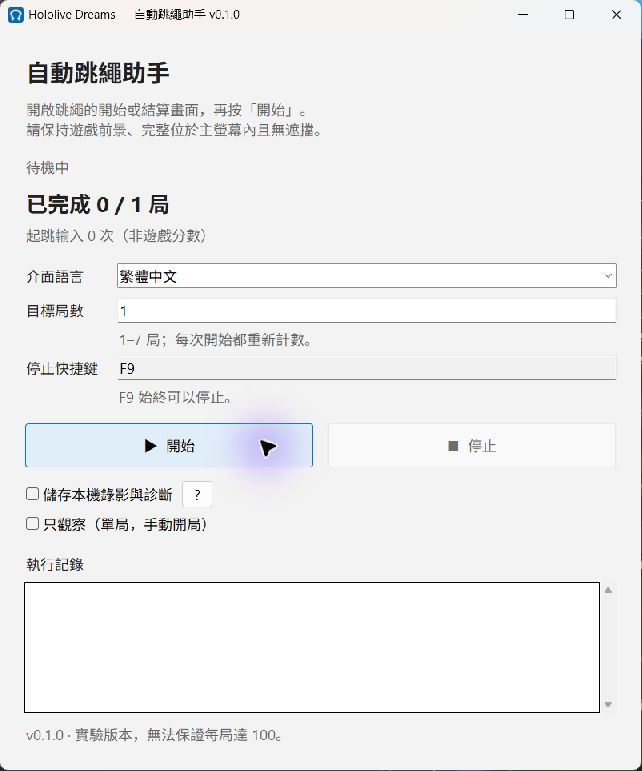

# Hololive Dreams Jump Rope Auto

Windows 上的实时视觉跳绳辅助程序。图形界面支持繁體中文、简体中文、English、日本語、한국어和 Bahasa Indonesia，可选择 1–7 局、设置停止快捷键、查看运行日志和保存本地诊断录像。

**0.1.0 是实验版本，仍可能漏跳或误判，不保证每局 100。** 本次优化的实际成绩与停止条件见 [优化记录](docs/optimization-0.1.0.md)。游戏历史最佳 132 来自用户录像；界面的输入次数不是游戏分数。

最终 GUI EXE 七局实测 **85 / 85 / 89 / 103 / 87 / 86 / 83**，完整验收与结算图片见 [发布验收](docs/validation-0.1.0.md)。



## 使用

从 [Releases](https://github.com/harrykuang-dev/Hololive-Dreams-Jump-Rope-Auto/releases) 下载 `HololiveDreamsJumpRopeAuto-0.1.0.exe`，双击运行，不需要安装 Python。打开游戏的跳绳活动页、游玩入口或成绩页，保持游戏完整位于主屏幕内、无遮挡，然后在辅助程序中点击开始。

- 默认运行一局；局数只能选择 1–7。正常结算并确认成绩页后才开始下一局，到指定局数后停止，不无限重开。
- 默认停止键为 **F9**，即使设置其他快捷键，F9 仍有效。点击快捷键输入框后按所需组合键；停止按钮与关闭窗口也会停止控制并等待录像收尾。
- **不调整能量，不使用能量恢复、BOOST、MODE、购买或道具。** 零能量可以正常游玩，能量不是开局条件。
- 界面语言只改变辅助程序文字。当前游戏菜单模板按繁體中文界面验证，其他游戏语言尚未实战验证。
- 勾选“仅观察”时不发送任何输入，需要自行开始游戏，观察约 10 秒后停止；该模式只允许一局。
- 同一时间只运行一个控制器。运行期间设置锁定，避免中途改变局数或停止键。

失焦、遮挡、未知实战画面、窗口移动、超时、捕获错误或录像硬故障会停止。测试时不要切换游戏窗口或打开覆盖游戏的窗口。默认 DXGI 仅取得新画面，不重复使用旧帧发出起跳。

## 本地诊断

默认不保存视频。开始前勾选诊断选项，会把每局 MP4、`.events.json`、会话版本／EXE 哈希及日志保存在 `%LOCALAPPDATA%\HololiveJumpRopeAuto\sessions\`。帮助窗口可打开该目录，**不会自动上传**。

JSON `frames[N]` 对应 MP4 第 N 张，每张记录画面只写一次，没有插帧。视频使用 60 FPS 时基，实际捕获不足 60 时播放会加速；实际输入时间看 JSON `t`／`input_t`，捕获吞吐看 `performance.actual_round_fps`。游戏分数应核对录像的结算画面。

录像后台编码，32 张内存缓冲满后使用 256 MiB 有界无损本地暂存，保持 FIFO 顺序。暂时拥塞可在编码恢复后排空；持续容量耗尽、低磁盘空间和编码失败仍停止。成功排空后移除暂存，失败暂存保留。

## 实现与验证

起跳依据当前可见细线、分区绳形拟合、接近方向和贴地回摆。没有固定间隔、预定加速或失去视觉后的周期补跳。中央玩家由游戏黄色标记定位，不绑定服装或发色。部分道具遮挡、绳形误拟合和场景切换仍可能影响成绩。

测试覆盖旧录像时机回归、安全门、菜单重试、新鲜帧、录像拥塞／磁盘错误、界面会话停止与局数上限。发布识别策略采用最佳已验证基准 v18b；最后三个候选未显著进步，按约定停止调参。[归档候选](experiments/) 及四项专属测试仅供离线研究，主程序不使用。测试通过不等于游戏达到 100。以前的单局 102 达标证据见 [v15 验证](docs/batch-v15-validation.md)，后续完整七局结果见 [优化记录](docs/optimization-0.1.0.md)。

## 源码运行与构建

需要 Windows 和 Python 3.10+（本次使用 Python 3.13）。建议使用虚拟环境：

```powershell
python -m pip install -r requirements.txt
python -m pip install -r requirements-dev.txt
python main_ui.py
```

构建图形界面：

```powershell
python tools/build_release.py
python tools/verify_release_bundle.py dist/HololiveDreamsJumpRopeAuto-0.1.0.exe --output build-verification.json
```

生成 `dist/HololiveDreamsJumpRopeAuto-0.1.0.exe`。构建会清理打包缓存，静态核验命令不启动程序；它比较冻结源码和资源，并确认归档候选未打包。EXE、build、debug、大型录像不进 Git；克隆后需构建或下载 Release。

开发用命令行入口：

```powershell
python tools/run_batch_test.py
python tools/run_round_test.py --rounds 1
python -m pytest -q
python -m pytest -q -m gui
```

默认测试排除会创建 Tk 窗口的界面测试；后者只用模拟会话，但必须在没有实战控制器运行时执行，避免窗口影响游戏焦点。命令行局数上限同样为七；`--observe`／`--manual-start` 只支持一局。

离线录像分析可用 `tools/analyze_round_failures.py`、`tools/replay_recorded_geometry.py` 和 `tools/audit_batch.py`，它们不会操作游戏。

## 许可与致谢

本项目使用 [MIT License](LICENSE)。界面布局、高 DPI 处理和快捷键解析参考了同作者的 [Hololive Dreams Fishing Auto](https://github.com/harrykuang-dev/Hololive-Dreams-Fishing-Auto)，保留其 [MIT 声明](third_party/fishing-auto-MIT.txt)。程序图标为代码绘制的原创绳圈图形。
